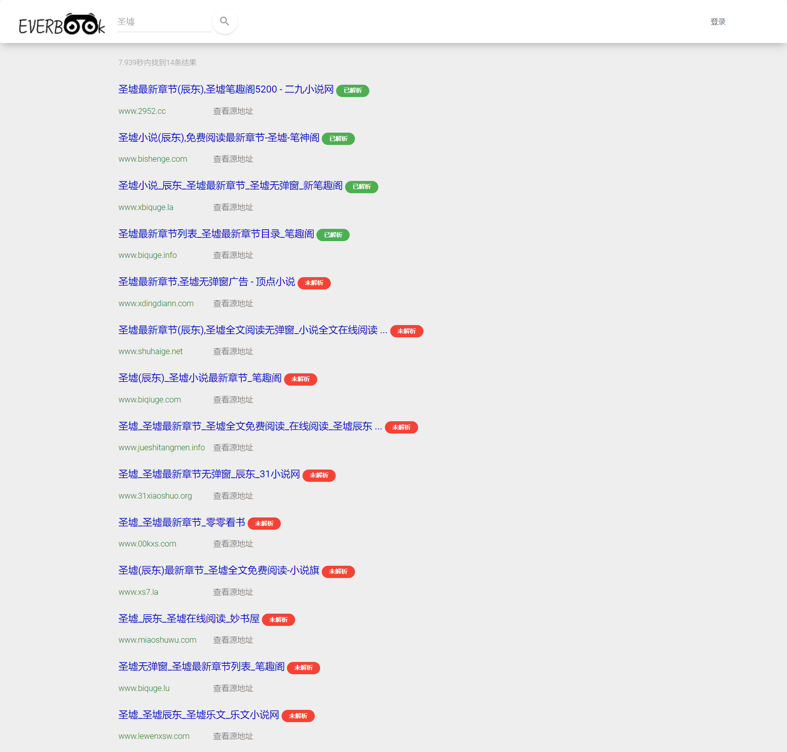
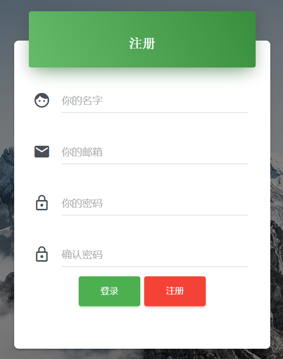

# EverBook

[](https://github.com/Three-year-old/everbook)

## Chapter
 - [Background](#Background)
 - [Install](#Install)
 - [Preview](#Preview)
 - [Documents](#Documents)
 - [Reference](#Reference)
 - [Todo](#Todo)
## Background
本项目灵感来源于[owllook](https://github.com/howie6879/owllook) ，以该项目作为基础，采用`FastAPI`作为后端框架，构建了一个简单的垂直网络小说搜索引擎。

一来了解`python`的异步爬虫`aiohttp`，二来对`python`的高性能异步web框架`fastapi`做一次上手练习。
## Install
首先安装`FastAPI`
```commandline
pip install fastapi
```
并使用`uvicorn`作为运行代码的服务器
```commandline
pip install uvicorn
```
项目相关依赖包含在`requirements.txt`中，并在`python`环境在安装
```commandline
pip install -r requirements.txt
```
确保`Redis`安装成功

[windows下Redis安装](https://github.com/microsoftarchive/redis/releases) | [linux下Redis安装](https://redis.io/download)

克隆项目到本地
```commandline
git clone https://github.com/Three-year-old/everbook.git
```
进入项目根目录
```commandline
cd everbook
```
启动`fastapi`服务
```commandline
python main.py
```
当控制台输出
```commandline
INFO:     Started server process
INFO:     Waiting for application startup.
INFO:     Application startup complete.
INFO:     Uvicorn running on http://0.0.0.0:8000
```
打开浏览器，输入[localhost:8000](http://localhost:8000)即可看见项目已经启动完毕
## Preview
首页

搜索结果页

小说章节页

小说正文页

登录页

注册页

用户书架页

## Documents
关于爬虫解析部分的文档请看[这里](./docs/fetch.md)

关于`FastAPI`框架部分的文档请看[这里](./docs/fastapi.md)

关于前端部分的文档请看[这里](./docs/web.md)
## Reference
### 依赖
- `fastapi`：现代、快速（高性能）的`web`[框架](https://fastapi.tiangolo.com/)
- `Jinja2`：基于`python`的模板引擎
- `aiohttp`：`python`[异步爬虫](https://docs.aiohttp.org/en/stable/)
- `redis`：`python` `redis`模块
### 插件
- `Material Kit`：[`Material Design UI`](https://www.creative-tim.com/product/material-kit) 工具包
- `Jquery`：一个快速、简洁的`JavaScript`框架
- `Cookie`：`Jquery`操作`Cookie`的[插件](https://cdn.bootcdn.net/ajax/libs/jquery-cookie/1.4.1/jquery.cookie.min.js)
- `Sweetalert2`：漂亮可定制的`JavaScript`[弹窗](https://sweetalert2.github.io/)
## Todo
- [ ] 部署上线
- [ ] 扩增解析规则
- [ ] 最新章节功能（与爬虫相关，而且`owllook`项目中已经实现，并不打算再去完成）
- [ ] 项目中的`todo`注释
- [ ] 写一套`RestfulAPI`
