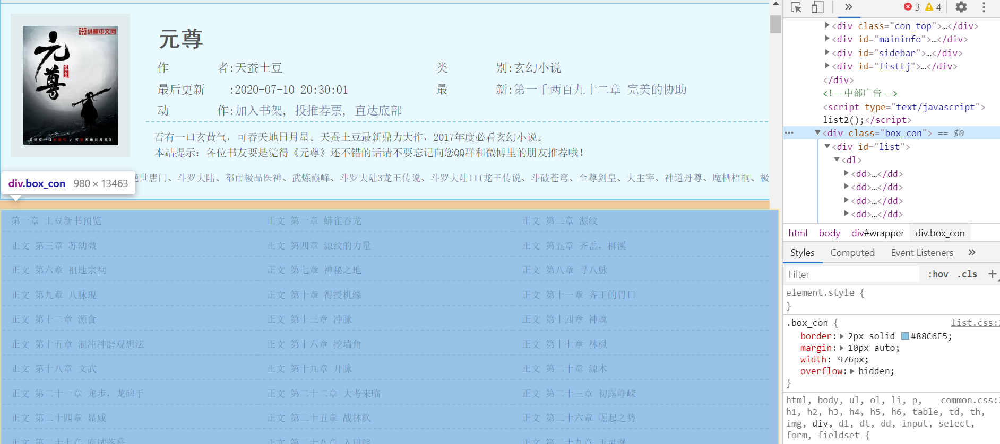
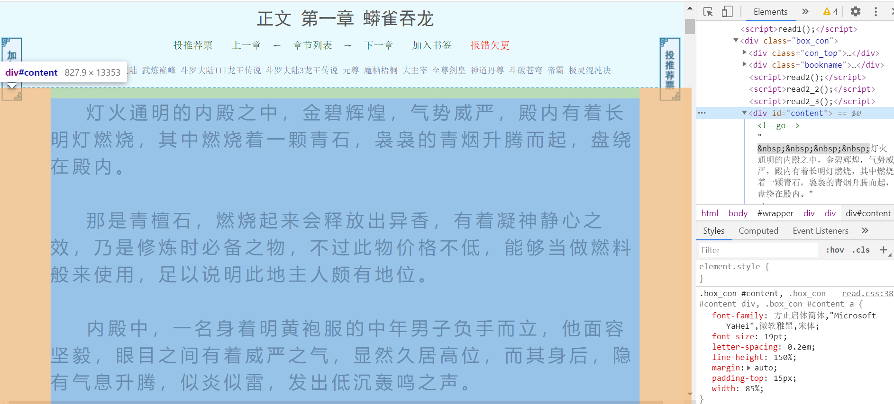

# 异步爬虫与解析规则
由于小说来源是在线解析的，因此选用异步爬虫来提升效率，并且需要指定相应的解析规则来匹配数据。

## 异步爬虫
`aiohttp`上手非常简单，安装好相关库依赖后，就可以直接使用了，官方文档里提供了最简单的例子
```python
import aiohttp
import asyncio

async def fetch(session, url):
    async with session.get(url) as response:
        return await response.text()

async def main():
    async with aiohttp.ClientSession() as session:
        html = await fetch(session, 'http://python.org')
        print(html)

if __name__ == '__main__':
    loop = asyncio.get_event_loop()
    loop.run_until_complete(main())
```
使用时需要实例化`aiohttp.ClientSession()`对象，并且加入`async`、`await`关键字。

在本项目中，不同的搜索引擎爬虫都继承于一个公共爬虫，目录位置为[`BaseCrawler.py`](../fetch/BaseCrawler.py)，在这个公共爬虫里，就定义了类似上述例子中的抓取函数。

对于不同的搜索引擎，定义了不同的搜索结果提取函数`data_extraction`，在这个函数中，需要对搜索引擎的搜索结果进行提取，包括提取搜索结果的标题已经链接地址（百度搜索结果的真实链接地址经过了加密，因此需要多进行一步处理）

具体实现见[`BaiduCrawler.py`](../fetch/BaiduCrawler.py)、[`BingCrawler.py`](../fetch/BingCrawler.py)、[`SoCrawler.py`](../fetch/SoCrawler.py)


## 解析规则

项目中定义了一个数据库来存储解析规则，数据库模型见[rule](../sql_app/models.py)
```python
class Rule(Base):
    __tablename__ = "rule"

    id = Column(Integer, primary_key=True, index=True)
    netloc = Column(String)
    """
    choice
    0: 表示章节网页需要当前页面url拼接
    1: 表示章节链接使用本身自带的链接，不用拼接
    2: 用域名进行拼接
    """
    choice = Column(Integer)
    chapter_tag = Column(String)
    chapter_value = Column(String)
    content_tag = Column(String)
    content_value = Column(String)
```
`rule`表中含有的字段分别为`netloc`域名、`choice`章节链接拼接规则、`chapter_tag`在`html`页面中包含章节链接的标签名称、`chapter_value`在`html`页面中包含章节链接的标签属性值、`content_value`在`html`页面中包含正文内容的标签名称、`chapter_value`在`html`页面中包含正文内容的标签属性值。

以笔趣阁系列网站为例子，随便找一个小说，以开发者模式检查页面

可以看到该小说的所有章节都包含在`<div class="box_con"></div>`这一标签中，而正文内容

包含在`<div id="content"></div>`这一标签中，那么这一条解析规则在数据库中存储格式应该为

| 字段 |   值   |    
| ---- | ----|
|`netloc`|`http://www.biquge.info/`|
|`choice`|`0`|
|`chapter_tag`|`class`|
|`chapter_value`|`box_con`|
|`content_tag`|`id`|
|`content_value`|`content`|
在本项目中，没有只定位`html`标签，而是对找到的标签再次提取文本数据，具体见[`parse.py`](../fetch/parse.py)。

这里还设置了黑名单域名，例如`www.17k.com`、`book.qidian.com`、`www.baike.com`等网站，这里不含有可以解析的内容，解析搜索结果时应该过滤这些黑名单域名，黑名单域名可以直接在`blacklist`数据库表中添加。